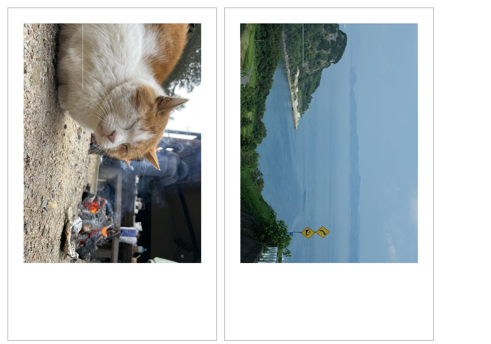
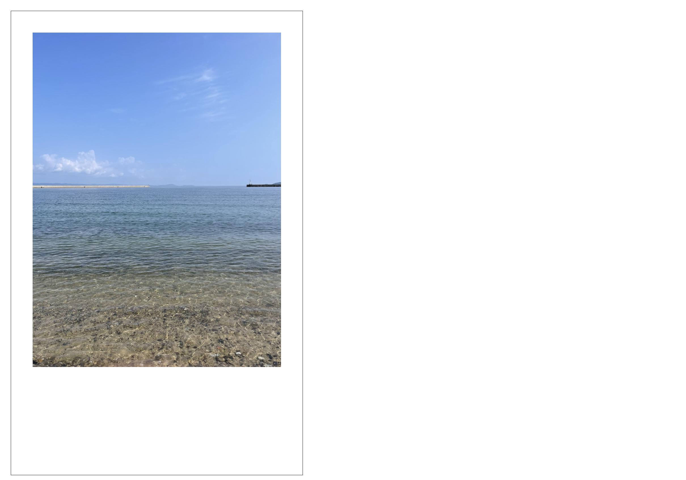

# img2cheki

画像をチェキ風に印刷できるようにするツールです。サイズはinstax miniに対応しています。
L版サイズなら、一枚あたり２枚、2L版なら4枚印刷できます。

## 使い方

### インストール

```bash
go get github.com/nac-39/img2cheki
```

### 使い方

`img2cheki.Img2Cheki`関数を使って画像を変換できます。

```go
func Img2Cheki(paths []string, output_path string, config Config, output_size Size, format ImageFormat)
```

引数

- `paths` : 変換する画像のパスの配列(ex. `[]string{"sample1.jpeg", "sample2.jpeg", "sample3.jpeg"}`)
- `output_path` : 出力先のファイル名のプレフィックス(拡張子は自動で付与されます)
- `config` : DPI, ボーダーの幅, 出力時の余白の設定 (ex. `Config{DPI: 350, BorderWidth: 0.01, OutputMargin: 0.1}`)
- `output_size` : 出力時のサイズ (ex. `Size{Width: 12.7, Height: 8.9}` は日本のL版サイズ)
- `format` : 出力時の画像フォーマット(ex. `img2cheki.JPEG` or `img2cheki.PNG`)

## 使用例

```go
package main

import "github.com/nac-39/img2cheki/img2cheki"

func main() {
 const dpi = 300
 unit := img2cheki.UnitConfig{DPI: dpi}
 images := []string{"sample/sample1.jpeg", "sample/sample2.jpeg", "sample/sample3.jpeg"} // example
 output_prefix := "sample/output"                                                     // example
 output_size := img2cheki.Size{Width: unit.Cm(12.7), Height: unit.Cm(8.9)}            // 日本のL版サイズ

 img2cheki.Img2Cheki(images, output_prefix,
  img2cheki.Config{DPI: dpi, BorderWidth: unit.Cm(0.01), OutputMargin: unit.Cm(0.2)},
  output_size, img2cheki.JPEG)
}

```

実行コマンド

```bash
% go run main.go
```

### 画像サンプル

三枚の画像を２枚のL版サイズに出力します。


結果


